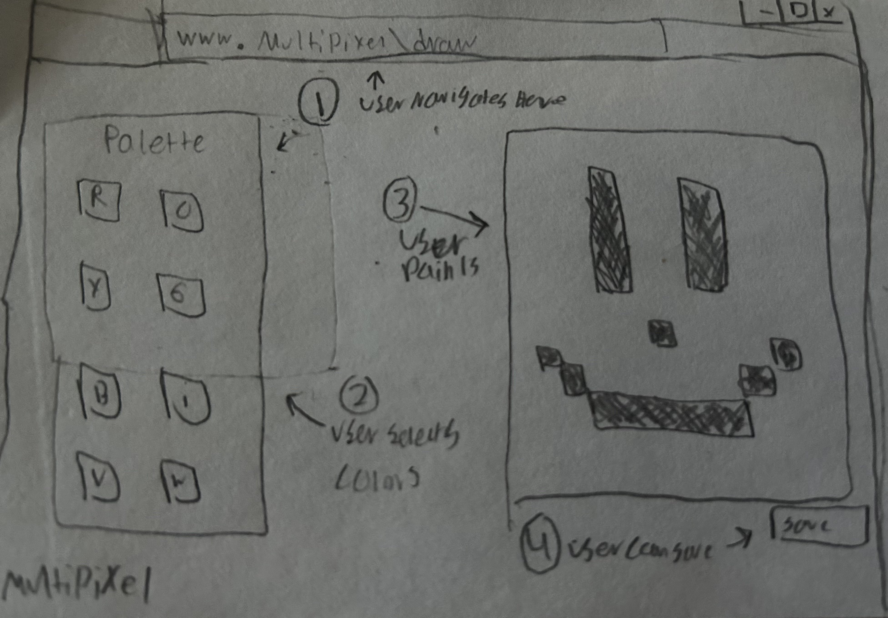
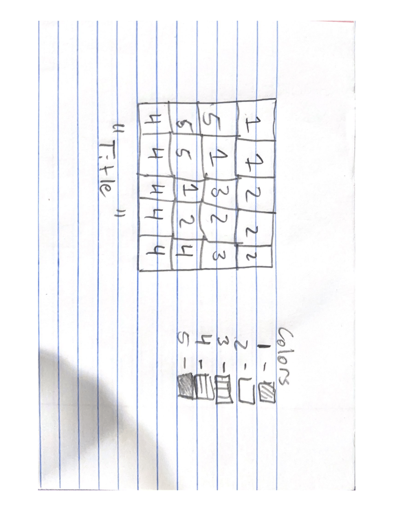

Group 04 – "MultiPixel"\
Date and location: Feb 11, 2024\
Group Members: Aidan Trujillo, Hunter Beach, Colton Leighton, Mathew Gardner, Thomas Rotchford

# D2 Deliverable

## 1. Positioning

#### Problem statement:
> "The problem of limited creative outlets for relaxation and self-expression on the web affects stressed individuals who can't run or afford a download-based video game; the impact of which is individuals being compelled to engage with web-based games that are poorly made or uninteresting, and downloadable programs that our poorly optimized or overly expensive."

#### Product Position Statement:
> "For individuals experiencing stress who prefer a hassle-free web-based solution over downloadable games, MultiPixel offers a unique online video game experience. Users can unwind and relax by coloring a diverse collection of pixel art drawings using the popular "Color by Numbers" method. What sets MultiPixel apart from other pixel-based coloring games is the ability for users to not only color existing drawings but also create and share their pixel art masterpieces. Our platform features a community hub where users can showcase their creations, allowing others to download and enjoy coloring their artwork, fostering a collaborative and creative community experience. "

#### Value proposition and customer segment:
> "MultiPixel is an online relaxation video game designed to offer a more enjoyable experience for stressed individuals during their leisure time.  Our program is unique as it offers free, easy access to pixel painting software, which can be interacted with anytime, simply through a web browser, helping solve the problem above. Additionally, it fosters a sense of community through a workshop feature where users can showcase their creations, allowing others to download and enjoy coloring their artwork."

> Stressed individuals who can't run or afford a download-based video game

## 2. Stakeholders
Make a list of all stakeholders of the project with a brief description of each one of them, emphasizing any responsibilities with the project. Examples of stakeholders include users, clients, competitors, detractors, developers, etc.

People who will play the game
-students in class
-artists
-people who want a relaxing game
-people who want multiplayer with friends
Competitors
- any other pixel-based software
- web games that are played in class
Developers
-us
Clients/Boss
- Ana

## 3. Functional requirements (features) 

Make a numbered list of requirements for your software. Just self-explanatory titles are enough at this point. Remember that requirements should deliver the value proposition and they must be consistent with the interviews you performed for the previous deliverable. You can talk again to your clients to help define the requirements. While writing the requirements, focus on the capabilities needed and not on how they should be implemented.

1. Access to an online database of user creations
2. Universal Theme, Easy to understand UI
3. User Account Services
4. Store user information

## 4. Non-functional requirements

*Non-functional requirements* 

1. Security (Makes sure the site is secure and users don't have to work about stolen information by encrypting all sensitive information and storage)
     - Site data is encrypted and not easily accessed by random users/people
2. Performance (Allows a seamless user experience between all aspects of the site)
     - Website should be smooth and seamless on any device 
3. Portability (Users should be able to use the website on any device that can connect to the site)
     - Game and site work on both a computer and a smartphone through the browser
4. Availability (Site should always be available and not crash often)
     - Site is up all the time
5. Maintainability (Codebase should be well written and commented to allow future upgrades and additions with ease)
     - Code is well commeted and easy to read

## 5. MVP

*MVP:*
A five-by-five grid with colors set to a certain number allows the user to fill in the grid depending on the number in the square with the correct color to complete a drawing. The drawing is to be saved into a database so the user can come back to a drawing later. The entire website will fit into a universal and coherent theme.

The MVP will be tested through prototyping and user testing.

We are going to validate these things first
- Our ability to make and host a website which can be viewed by others
- Our ability to make a working UX/UI the user can interact with with ease
- The system's ability to turn a painting of pixels into a file of numbers that can be sent to the database
- as well as vice versa

Later goals such as workshops, templates, galleries, multiplayer or minigames, Will all be validated in the future,
But our main goal is to validate those concepts above

## 6. Use cases

#### Use Case Descriptions and Interface Sketches:

    Use Case: Create Unique Pixel Art 
    Actor: User 
    Description: A user will open the website for MultiPixel, and be able to pick colors from a palate to paint with onto a canvas of pixels. 
    Preconditions: The user has access to the website through any means. The user navigated a UI menu to reach the drawing page 
    Postconditions: The user will have created art which they may or may not save

    Main Flow:
    1. The user opens the app for MultiPainter having already traversed the UI Menu to reach the "Create Pixel Art" page
    2. The user log in/sign up
    3. The user picks colors from the palette and places them onto a canvas in whatever order they please, making their art
    4. The user may or may not choose to save this art they made

    Alternative Flow:
    1. The user does not log in or sign up
    2. The user picks colors from the palette and places them onto a canvas in whatever order they please, making their art
    3. The user is not able to save

     Use Case: Create MultiPixel Interface/Game Mode Page
    Actor: User 
    Description: A user will login to the website for MultiPixel using either a previous login page or the lower right menu.
    Preconditions: Game mode page and art interface are on the same page 
    Postconditions: Game modes may change throughout drawing process if changed in game mode menu.

    Main Flow:
    1. The user opens the login/sign up page or the main interface page.
    2. The user logs in/signs up.
    3. The user picks game mode and may play once screen is used.
    4. The user may or may not choose to save this art. They can also change tyhe game mode using the side screen.

    Alternative Flow:
    1. The user switches game mode mid game.
    2. The user signs in or resets password using lower right page which sends them to alternative page.
    3. The user is not able to save their game.
    

    Use Case: Adjust game settings
    Actor: User 
    Description: The user will click on the settings "gear-icon" on the homepage of multipixel and be able to adjust the volume,brightness, UI scale, and several other things.
    Preconditions: The user is able to access the homepage 
    Postconditions: The user will have changed and saved the game and UI settings to their desired specifics

    Main Flow:
    1. User clicks the "gear-icon" on home page
    2. User adjusts setting silders to their perfered values
    3. User may choose to save selected settings or not
    4. User is auto redirected to the home page with new settings applied

    Use Case: Follow Pixel Art Template 
    Actor: User 
    Description: A user will open the website for MultiPixel, and be able to pick a template to paint by numbers
    Preconditions: The user has access to the website through any means. The user navigated a UI menu to reach the drawing page 
    Postconditions: The user will have colored a painting.

    Main Flow:
    1. The user clicks on a template they want to complete
    2. The template is loaded for the user to color
    3. The user begins filling in the numbers with the corresponding color
    4. A finish message is loaded that prompts user to save.
    5. The user selects to save.
    6. The painting is saved to users account.

    Alternative Flow:
    1. The user decides to go back without saving.
    2. System loads the template list again. 

    Alternative Flow:
    1. The user is not logged in.
    2. System prompts user to log in.
    3. The user then logs in.
    4. The user is now able to save.

    Alternative Flow: 
    1. The user does not have an account.
    2. The user is prompted to create an account.
    3. The user account is created. 
    4. The painting is saved to their account. 

## 7. User stories
Establish a priority level for each user story and estimate how many hours each one will demand using the planning poker approach. 

Grading criteria (6 points): Use the provided format. The user stories should be in an adequate level of granularity (not too broad nor too specific). Provide the priority and estimation for each user story.

##### Matthew:

- As a user, I want to be able to see all the pixel painting I have completed so far, so that I can come back and look at my completed work. 
    - Priority: 4
    - Estimation: 1
- As a user I want to have the ability to comment on others painting that they have published, so that I can interact with other users and make a nice community.
    - Priority: 5
    - Estimation: 5

##### Thomas:

- As a college student, I want an easy and idle game to play in class, so that I focus better on lectures.
    - Priority: 1
    - Estimation: 10
- As a casual gamer, I want to play a fun and relaxing game, so that I can unwind with friends at the end of the day.
    - Priority: 3
    - Estimation: 5

##### Aidan:

- As a user I want to be able to create my own paintings so that I can share with others my art work. 
    - Priority: 2 
    - Estimation: 3
- As a developer I want the ability to ban user accounts so that there is a respectful and encouraging environment.
    - Priority: 1
    - Estimation: 1

##### Hunter:

- As a user with a weak computer, I want a well-optimized game with no download, so that I can play an artsy game without adding strain to my computer
    - Priority: 3
    - Estimation: 3
- As a user who enjoys multiplayer competitive games, I want an interesting competitive game mode to play against my friends, so that may have fun
    - Priority: 5
    - Estimation: 6

##### Colton:

- As a user who enjoys relaxing online games, I want a convenient, easy to use pixel art interface, so that I may play and compete in an optimal way.
    - Priority: 5
    - Estimation: 5
- As a user who plays multiplayer games, I want a few different strategic game modes, so that I may play with others in fun and interesting ways.
    - Priority: 3
    - Estimation: 4

## 8. Issue Tracker
The user stories should be registered in your GitHub issue tracker. Include here the link for your issue tracker and a screenshot of what you did. 

https://github.com/thomasrotchford/CS386-2024-multiPainter/issues

