#### **1.  Introduction**
"MultiPixel is an online relaxation video game designed to offer a more enjoyable experience for stressed individuals during their leisure time. Our program is unique as it offers free, easy access to pixel painting software, helping solve the problem of users who want to play and enjoy games, but for any reason, cannot download them. We at MultiPixel wish to offer a social and artistic break from the world where you and all your friends can paint and share art.”

Our main features are as follows. We want a home page that welcomes users to the site and also offers easy navigation. Next, we want a Free Draw page where users can draw whatever they please, with plenty of options for colors and palate sizes. Then, we want a Template page, where users can follow a paint-by-numbers template of certain drawings. After that, we want to implement a community page, where you can browse the drawings of other users. Furthermore, we want a profile and portfolio page where a user can view their drawings. Finally, we want a settings tab that allows users to alter the UI/UX of the website to their liking. And as can be seen below, we got it all!

<https://github.com/thomasrotchford/CS386-2024-multiPainter/tree/main>
#### **2. Implemented requirements**
List in this section, the requirements and associated pull request that you implemented for this release, following the example below---include the description of the requirement, a link to the issue,  a link to the pull request(s) that implement the requirement, who implemented the requirement, who approved it, and a print screen that depicts the implemented feature (if applicable). Order the requirements by the name of the student who implemented them.

|
**MVP Satisfied: Log In**

**Requirement:** *As a Recurring User, I want to log in and out of MultiPixel so that I can Save my Artwork.*

**Issue:** 

[**https://github.com/thomasrotchford/CS386-2024-multiPainter/issues/237**](https://github.com/thomasrotchford/CS386-2024-multiPainter/issues/237)

**Pull request:** 

[**https://github.com/thomasrotchford/CS386-2024-multiPainter/pull/112**](https://github.com/thomasrotchford/CS386-2024-multiPainter/pull/112)

**Implemented by:** Colton Leighton

**Approved by:** Hunter Beach

**Print screen:** Seen below, we can Sign into accounts through our Sign In Page
{ width=250px }|
| :- |

|
**MVP Satisfied: Sign Up**

**Requirement:** *As a Recurring User, I want to make an account for MultiPixel so that I can Save my Artwork.*

**Issue:** 

[**https://github.com/thomasrotchford/CS386-2024-multiPainter/issues/151**](https://github.com/thomasrotchford/CS386-2024-multiPainter/issues/151)

**Pull request:** 

[**https://github.com/thomasrotchford/CS386-2024-multiPainter/pull/248**](https://github.com/thomasrotchford/CS386-2024-multiPainter/pull/248)

**Implemented by:** Hunter Beach 

**Approved by:** Colton Leighton

**Print screen:** As seen below, users can make accounts for our website. When making and confirming a password they must match. Lastly, we ask our users not to use usernames or passwords from elsewhere, as we are yet to have complex encryption to ensure their security
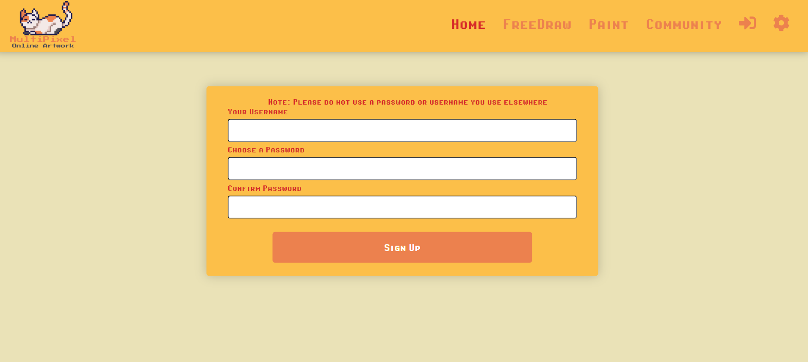{ width=250px }|
| :- |

|
**MVP Satisfied: Browse Art / Templates / Scroll Through Posts**

**Requirement:** *As a User, I want to Browse a list of people pages so that I can explore creatively*

**Issue:** 

[**https://github.com/thomasrotchford/CS386-2024-multiPainter/issues/150**](https://github.com/thomasrotchford/CS386-2024-multiPainter/issues/150)

**Pull request:** 

[**https://github.com/thomasrotchford/CS386-2024-multiPainter/pull/201**](https://github.com/thomasrotchford/CS386-2024-multiPainter/pull/201)

**Implemented by:** Matthew + Aidan + Thomas

**Approved by:** Hunter Beach

**Print screen:** As seen below, we have an extensive community page. I included two print screens to show off all the great art our users have made. This works as both our way to view other users' art, as well as our way to view templates. Simply click on a thumbnail of an art piece to use it as a template!

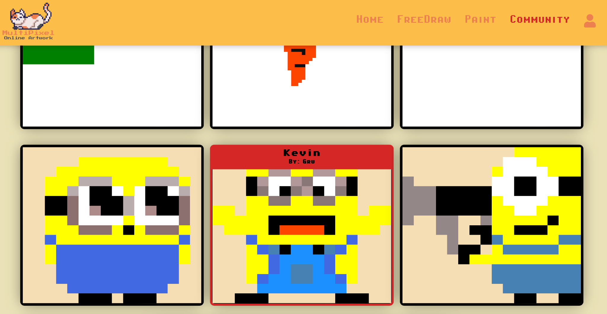{ width=250px } { width=250px }||
| :- |

|
**MVP Satisfied: Drawn on a Template**

**Requirement:** *As a User, I want to practice on other templates so that I can improve my personal pixel art skills*

**Issue:** 

[**https://github.com/thomasrotchford/CS386-2024-multiPainter/issues/122**](https://github.com/thomasrotchford/CS386-2024-multiPainter/issues/122)

**Pull request:** 

[**https://github.com/thomasrotchford/CS386-2024-multiPainter/pull/102**](https://github.com/thomasrotchford/CS386-2024-multiPainter/pull/102)

**Implemented by:** Aidan Trujillo 

**Approved by:** Thomas Rotchford

**Print screen:** As mentioned above, if the user clicks on a template they will be brought to the pain page for this particular art piece. The palette for the piece will be made of the colors in the piece, and the palate and the board will have matching number labels so the user knows where to paint. The user can then paint the template to begin to learn how to make this piece!
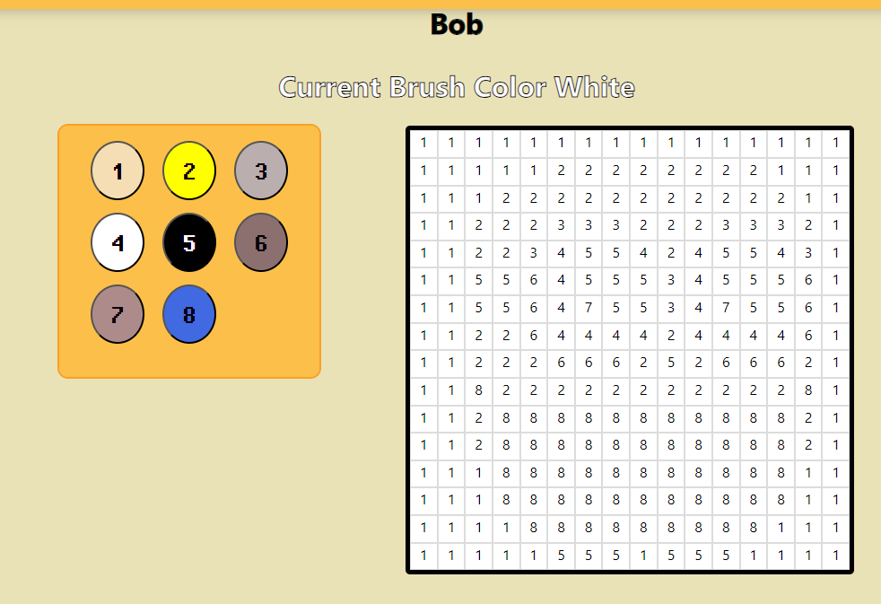{ width=250px }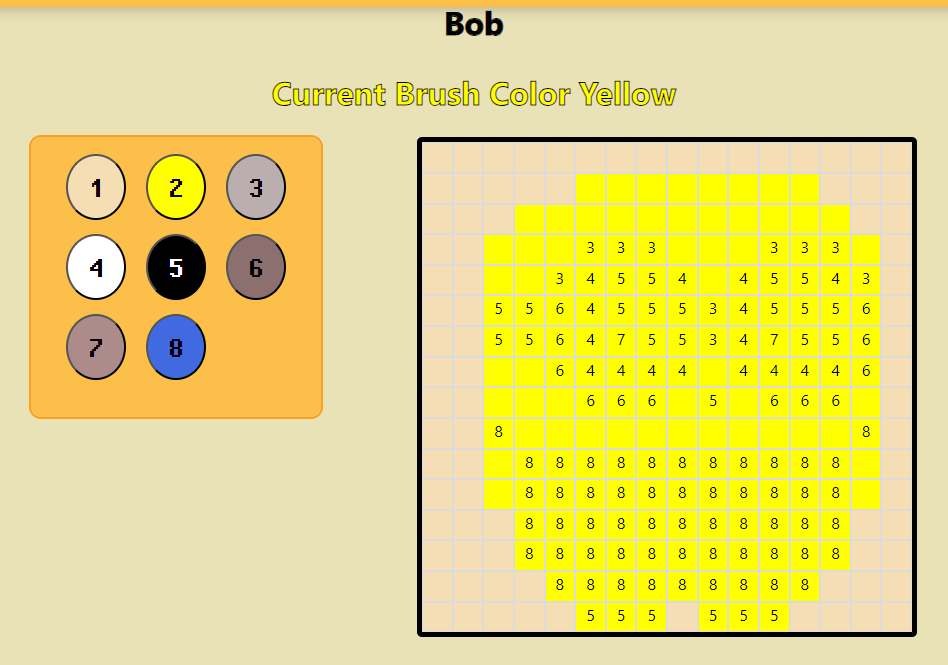{ width=250px }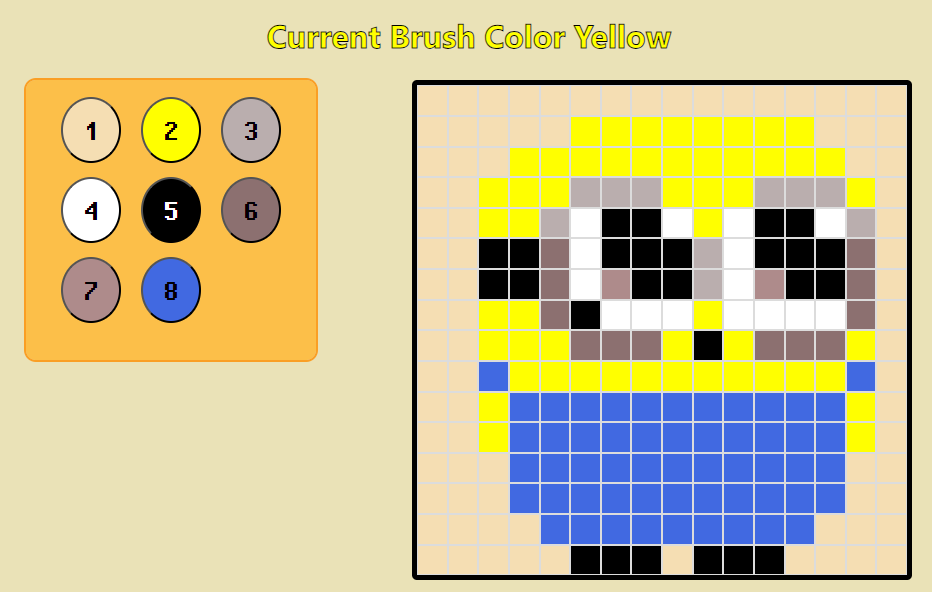{ width=250px }|
| :- |

|
**MVP Satisfied: Choose from 16 base colors**

**Requirement:** *As a Creative User, I Choose from many different colors so that I can make different kinds of paintings*

**Issue:** 

[**https://github.com/thomasrotchford/CS386-2024-multiPainter/issues/252**](https://github.com/thomasrotchford/CS386-2024-multiPainter/issues/252)

**Pull request:** 

[**https://github.com/thomasrotchford/CS386-2024-multiPainter/pull/253**](https://github.com/thomasrotchford/CS386-2024-multiPainter/pull/253)

**Implemented by:** Aidan Trujillo  + Matthew Gardner

**Approved by:** Hunter Beach

**Print screen:** Seen below, allows users to create their own palette with any number of colors.

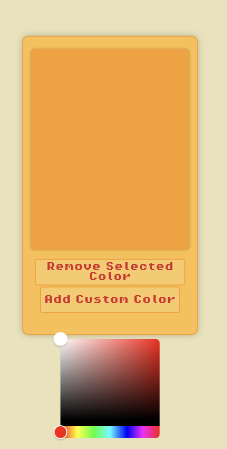{ width=250px }|
| :- |

|
**MVP Satisfied: Choose from 16 base colors**

**Requirement:** *As a Creative User, I Choose from many different colors so that I can make different kinds of paintings*

**Issue:** 

[**https://github.com/thomasrotchford/CS386-2024-multiPainter/issues/243**](https://github.com/thomasrotchford/CS386-2024-multiPainter/issues/243)

**Pull request:** 

[**https://github.com/thomasrotchford/CS386-2024-multiPainter/pull/244**](https://github.com/thomasrotchford/CS386-2024-multiPainter/pull/244)

**Implemented by:** Hunter Beach + Matthew Gardner

**Approved by:** Aidan Trujillo

**Print screen:** Seen below, on the left side of either paint page there are palettes for use. Rather than 16 base colors, we aimed for 9 as that fit better on a 3x3 grid. We made palettes for each main color in the rainbow, as well as some bigger palettes of size 16 and 25 including all colors. To switch between the palettes there are buttons right below the current palette. When the palette goes beyond 9 colors, you become able to scroll down within the div to see more colors

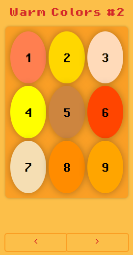{ width=100px }{ width=100px }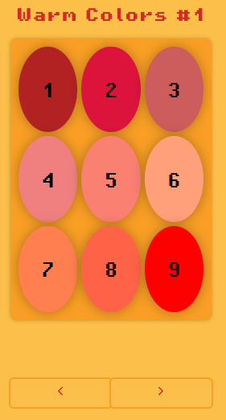{ width=100px }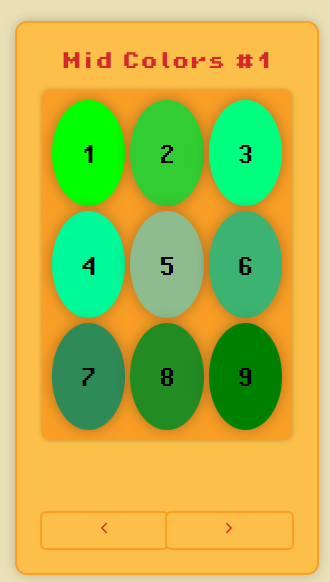{ width=100px }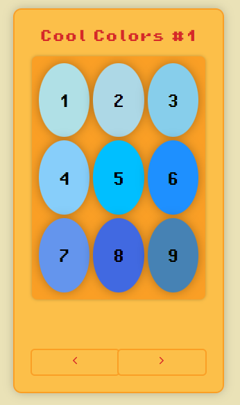{ width=100px }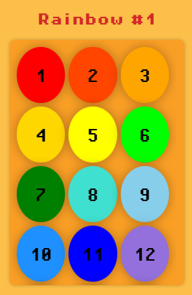{ width=100px }|
| :- |

|
**MVP Satisfied: Resize Grid** 

**Requirement:** *As a creative user. I want to make pixel art of different sizes, so that I can have more creative freedom*

**Issue:** 

[**https://github.com/thomasrotchford/CS386-2024-multiPainter/issues/88**](https://github.com/thomasrotchford/CS386-2024-multiPainter/issues/88)

**Pull request:** 

[**https://github.com/thomasrotchford/CS386-2024-multiPainter/pull/120**](https://github.com/thomasrotchford/CS386-2024-multiPainter/pull/120)

**Implemented by:** Aidan Trujillo

**Approved by:** Hunter Beach

**Print screen:** Seen below, in our settings tab to the left of the board, we can change the board size. We do this through an input box that is limited to 50, as a board with more than 50x50 divs will cause the page to lag from the sheer amount of divs on the page, and have it connected to a set board size button, so it doesn't change while you are picking your number.

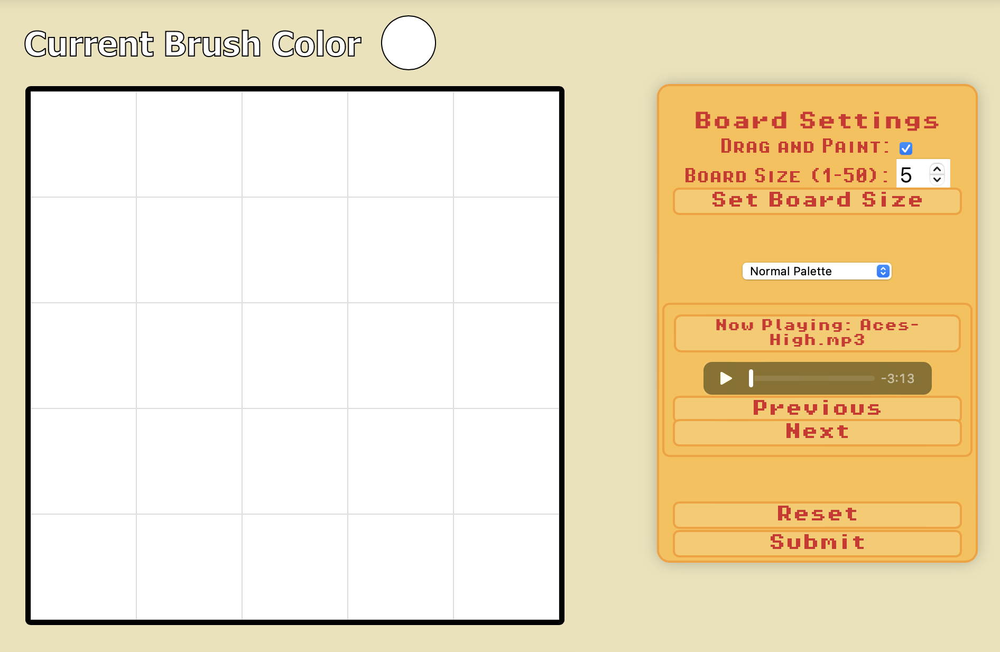{ width=250px }{ width=250px }|
| :- |

|
**MVP Satisfied: Implement SFX**

**Requirement:** *As a stressed user, I want to listen to relaxing and fun music while doing pixel art, so that I can feel more relaxed*

**Issue:** 

[**https://github.com/thomasrotchford/CS386-2024-multiPainter/issues/246**](https://github.com/thomasrotchford/CS386-2024-multiPainter/issues/246)

**Pull request:** 

[**https://github.com/thomasrotchford/CS386-2024-multiPainter/pull/257**](https://github.com/thomasrotchford/CS386-2024-multiPainter/pull/257)

**Implemented by:** Hunter Beach

**Approved by:** Thomas Rotchford + Matthew Gardner

**Print screen:** Seen below, In our settings div to the right of the board, we now have controls for music. It works through having an array of songs, where the previous and next buttons switch the index. All music is royalty-free and from Kevin Macleod so we can use it for personal projects. The controls can pause, play, start the music from anywhere, and control the sound, but we do NOT let our users download the music.

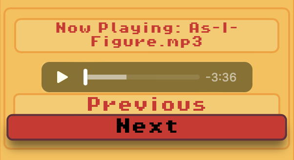{ width=250px }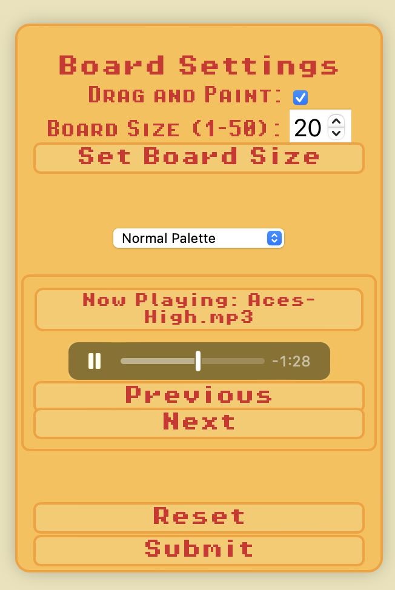{ width=250px }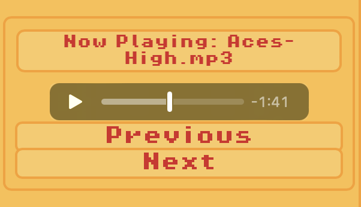{ width=250px }|
| :- |

|
**MVP Satisfied:** View your portfolio

**Requirement:** *As a Recurring User, I want to log in and be able to view all my pictures I have made.* 

**Issue:** 

[**https://github.com/thomasrotchford/CS386-2024-multiPainter/issues/171**](https://github.com/thomasrotchford/CS386-2024-multiPainter/issues/171)

**Pull request:** 

[**https://github.com/thomasrotchford/CS386-2024-multiPainter/pull/236**](https://github.com/thomasrotchford/CS386-2024-multiPainter/pull/236)

**Implemented by:** Colton Leighton

**Approved by:** Aidan Trujillo 

**Print screen:**

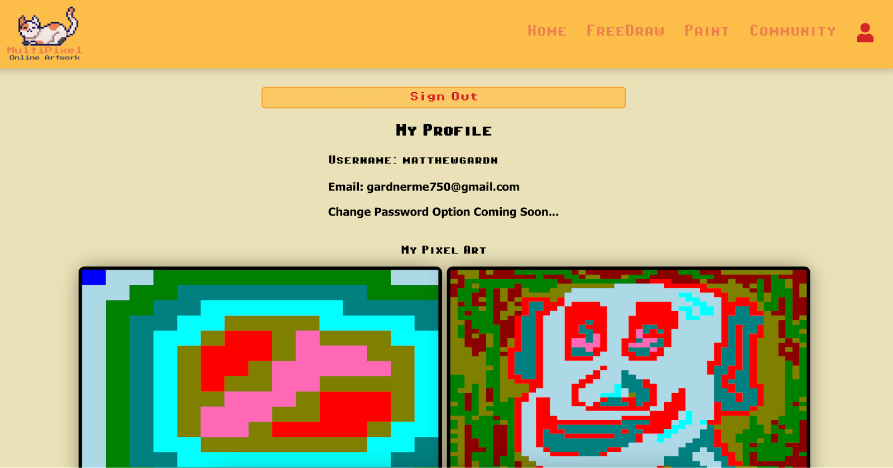{ width=250px }
|
| :- |

|
**MVP Satisfied:** Search through the different templates

**Requirement:** *As a user of the site, I want to be able to search through all the templates to find specific ones or things I like*

**Issue:** 

[**https://github.com/thomasrotchford/CS386-2024-multiPainter/issues/275**](https://github.com/thomasrotchford/CS386-2024-multiPainter/issues/275)

**Pull request:** 

[**https://github.com/thomasrotchford/CS386-2024-multiPainter/pull/271**](https://github.com/thomasrotchford/CS386-2024-multiPainter/pull/271)

**Implemented by:** Aidan Trujilo

**Approved by:** Matthew Gardner

**Print screen:** 

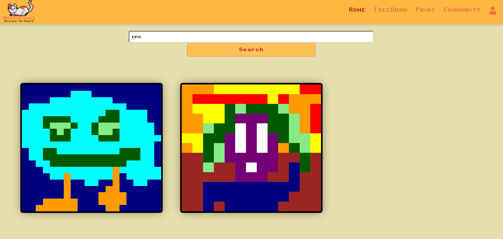{ width=250px }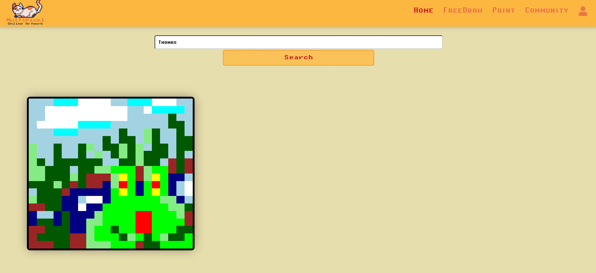{ width=250px }
|
| :- |

  

#### **3. Tests**
Summary: For our automated tests we used the framework Jest for our ReactJs code. A few configuration files were required for Jest to parse through the JSX. We tested the CreateBoard.js file which holds the board layout and 

- **Test framework: https://jestjs.io/**
- **Link to GitHub folder: [https://github.com/thomasrotchford/CS386-2024-multiPainter/tree/main/Unit%20Testing**](https://github.com/thomasrotchford/CS386-2024-multiPainter/tree/main/Unit%20Testing)**

**Test cases:**

- **Renders without Crashing:**

{ width=250px }

- **Renders Current Brush Color:**
{ width=250px }

- **Renders Current Palette Container:**

{ width=250px }

- **Renders Board Settings:**

{ width=250px }
**Results Of Tests:**

**One test failed because of what Jest perceived to be a syntax error on line 71 of paletteBoard.js, however it is not an actual error and the last 4 test cases passed.**

{ width=250px }

**FULL TESTING OUTPUT:**

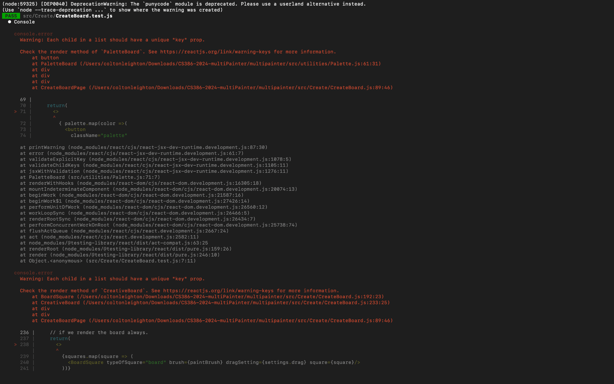{ width=250px }
{ width=250px }
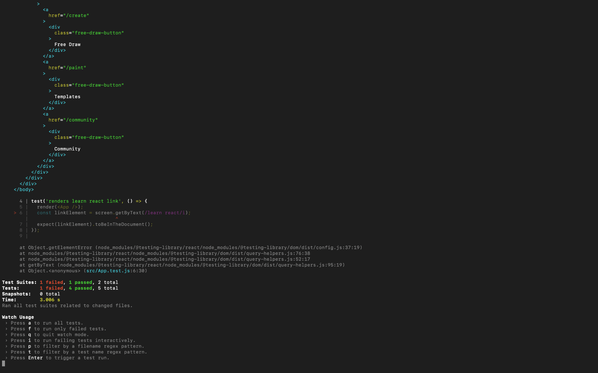{ width=250px }

#### **4. Demo**

https://youtu.be/vQvcEX6rh04

#### **5. Code quality**
We had to focus on this a lot in one of our meetings, as there were some sections where we had to have multiple people work on code, and they couldn’t understand or easily make sense of each other's work so we took some time one meeting and made some standards. So here they are:

First, we wanted to add lots of comments. Originally, we had none as we were just trying to write fast, but as time went on, we found comments were necessary so people other than the code’s author could read them

Keep in mind we have different rules for JSX, HTML, and CSS, as have their own rules and sets to follow, so it's hard to make a code policy that fits all of them, its better to make a code policy for each

**Policies for JSX:**

First, we tried to add one line of comment for every cohesive chunk of code and break up chunks of code. And add notes when necessary for sections of code that cannot be changed

{ width=250px }

As you can see, we also include TODOs when there is something we would like to implement or fix, but cannot get to at the moment, this is very helpful as you can just use “control+f (TODO)” if you would like to find something

Second, When making a cohesive chunk of code, like a class or a function, Offer a lot of comments at the top of the code, explaining what variables it uses, and what it does, 

**Example of a large comment on a Class:**

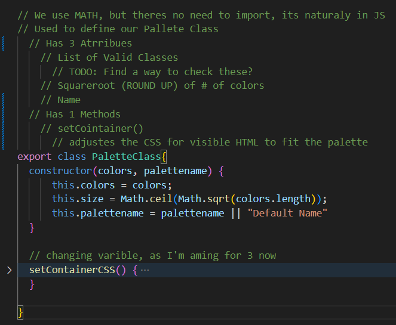{ width=250px }

**Example of a large comment on a Function**

{ width=250px }

Lastly, We also found it useful to include comments above each import, so we know what we are using it for, so we do not remove something we need. It also works as a flag to know when we can remove a certain import

{ width=250px }

**Policies For HTML**

For HTML the main thing we focused on was having the layout clear, with only one thing per line when possible. We also wanted to use self-defining IDs and Class names to avoid future confusion, but we get into that plan in the CSS section

`	`We decided to not use too many comments in HTML, as it is something we all know quite well, but it is worth using sometimes when the code isn't exactly clear

{ width=250px }

**Policies For CSS**

`	`We wanted all Class and Id names to be lowercase for the CSS naming convention and broken up with hyphens like the following (.key-button-list or #palette-container). This helped make the code more readable as everything follows the same scheme, making it easier to tell what's what. For example, if you EVER see a hyphen in a variable name or see a variable in a comment case, you can instantly know it's a CSS variable. Sometimes we define CSS inline for some elements, but we are in the process of cleaning that up, though it's not a high priority, our implementation is the highest priority. Seen below is an example of our CSS code following the naming convention.

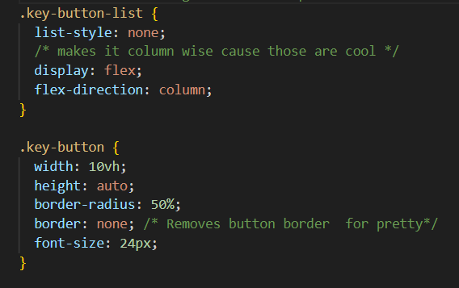{ width=250px }

We also used little comments here, as we are all experienced with CSS. The main thing we use comments for is if we have a particular style we wish to keep for the page or if there is a section of CSS that's complex and might not imD6_imagestely make sense to new eyes. Here are some examples of the times when we would use comments in CSS:

**Examples of important notes Styling:**

{ width=250px }

**Examples of important notes Functionality:**

{ width=250px }

**Examples of complex code:**

{ width=250px }

Other than the examples above, the other things we wished to implement into our rules for CSS were that we wanted everything we do to be self-defining, as well as we wanted to break up sections of similar CSS. This can be seen above on #palette-container where we have sections split into size, grid, placement, and background.

**Policies For Database**

When using the database, we also used log a lot, as that is the easiest way to track our code output, as well as it lets us look back at past versions of what we have done if necessary

{ width=250px }

**Overall**

All in all, we used lots of policies to help have cleaner code. There are some flaws, as there were segments that were written before the coding policies existed. As well are there some segments without these policies, as we were just trying to write fast and get it working? Both of these points will be touched upon in the Lessons Learned section. But these policies, when used, helped with clarity a lot!

#### **6. Lessons learned**
**Functionality Retrospect:** We had to rush again to get a lot of functionalities out. Our team thinks this might come from having unclear expectations for what everyone needs to do per week. We will try to make things more clear in the future

**Commenting Retrospect:** We implemented a commenting retrospect a bit late, and well as is imperfect in some areas. If we could go back, an auto-linter for the repo would be very helpful as it could help us catch commenting errors before they are pushed so we don't have lines of code that are hard to understand

**Pushing / Pulling Retrospect:** Our team had some issues with pushing and pulling throughout the project. In retrospect, it would be a good thing to decide how you want your team to push and pull ahead of time to avoid errors. One of our implementations almost got destroyed when we pushed directly to the main and overwrote some key data. I’ve had this happen in other projects as well, it's a bit of a pain. So to work against this, we made a plan to all push to own branches and check for breaks before merging.

We also made a plan to check for new code to pull/ push what you are currently working on every 30 minutes to keep the repository as up-to-date as possible. As we have run into issues where member A was on code, member B pushed, and then member A pushed without checking and overwriting some code.

While it's a pain, our team has decided that it's best practice to pull and push as much as possible for the sake of having an accurate repo that represents what code is currently written.

The last retrospect related to this is that we sadly fail this goal a lot, and intend to make more effort to push/pull in high amounts in the future.

**Issues Retrospect:** Right before the beginning of D6, we started making issues for things in the code we wished to improve/wanted to see changed. It took only a couple of minutes of me writing like this to fall in love with the method. First, with issues, you can assign them to people so people have clear ideas of their goals, as well and it would help stop 2 people from working on the same implementation (It's a big pain when this occurs ). Second, It's great for not getting distracted. Before this method, when I new idea, I would jump to it instantly, and occasionally forget what I was working on first. However, with issues, you can just make an issue for what you want to see changed, place a TODO marker where you want to see it changed and forget about it! Third, it helps make pulls clear, as they will have titles and be linked to issues so one can see exactly what each pull has done. Fourth, with the reviewers, you can guarantee that at least 2 people know about your code, which is much better than 1, as it greatly lowers the chance of your changes being forgotten or overwritten.

Overall, I enjoy the IssueTracker method and wish we started it soon, as it would have made this project so much easier. This method of using the Issue tracker is also something I would like to bring into my next projects. Our team was originally hesitant to do this as it took a little extra time, but It’s very beneficial.

**Time Constraints Retrospect:** We did a better job with time constraints around submitting the Deliverables, we feel this is because we more clearly defined what times we wanted everything done for the Deliverables, (6 hours before it was due) and that we would not accept late work into the project. We also assigned one of our team members as the “forever archivist” as they had good skills for converting and submitting the Deliverables. This helped us not run into technical issues when submitting which is also good.

